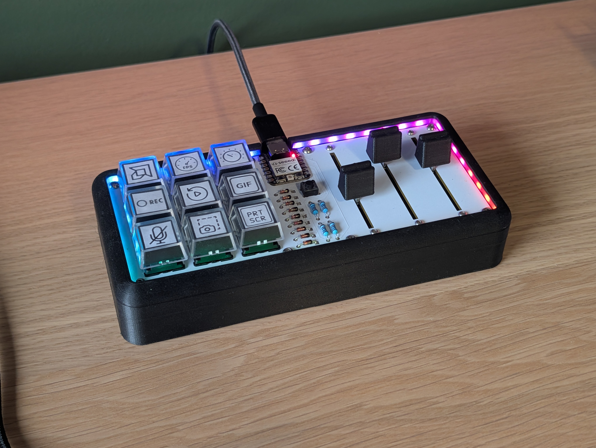
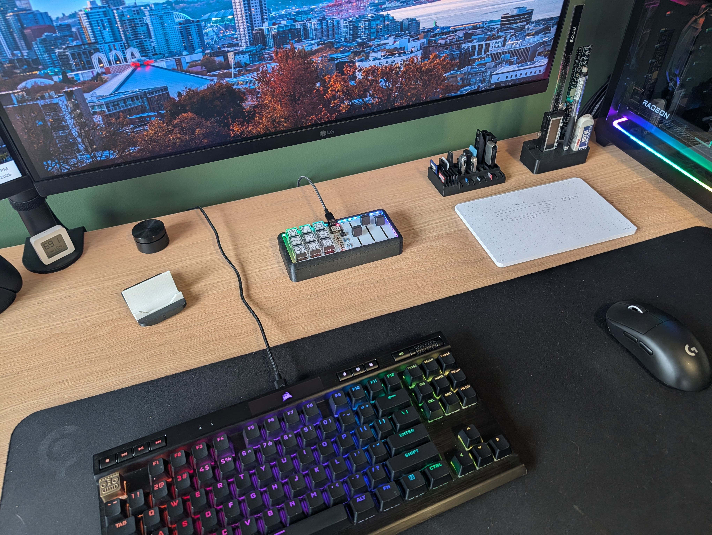
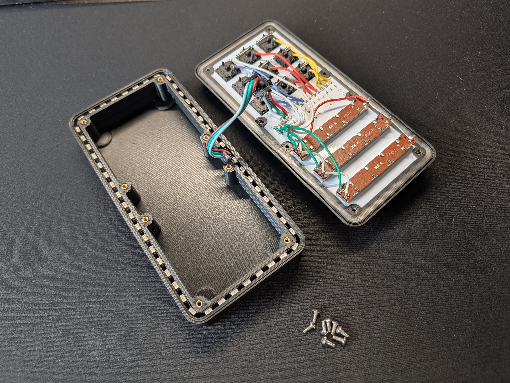
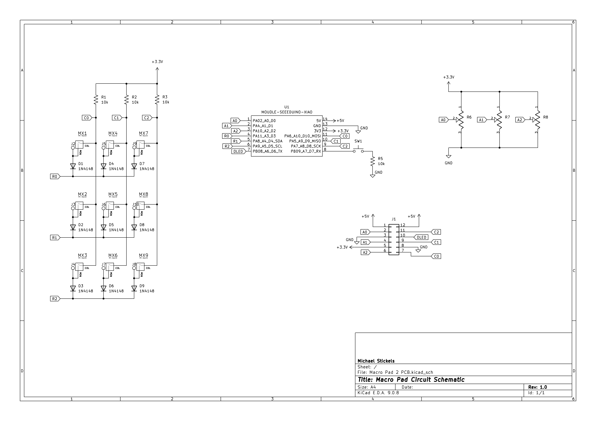
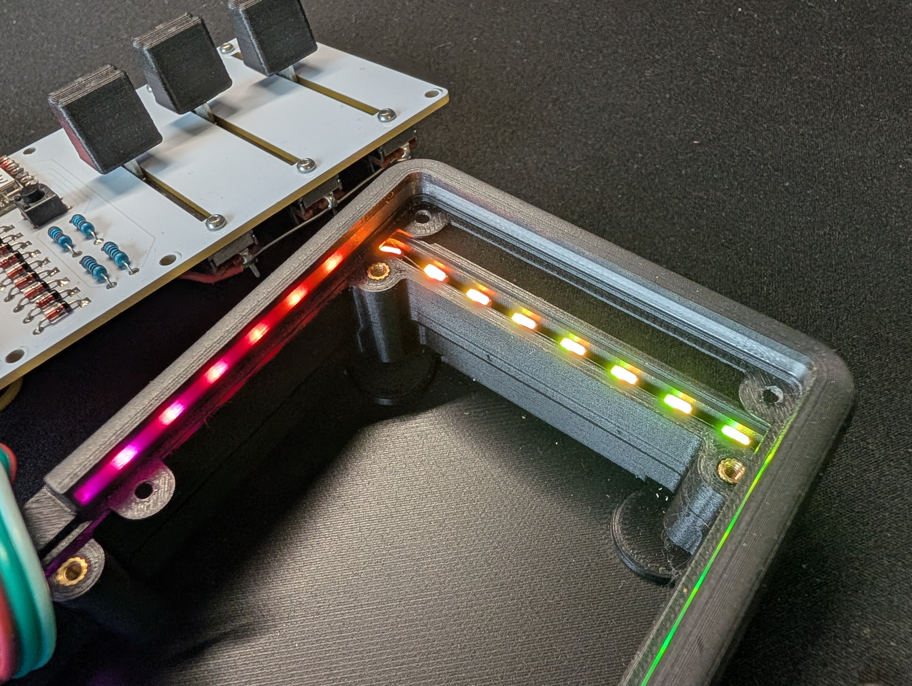
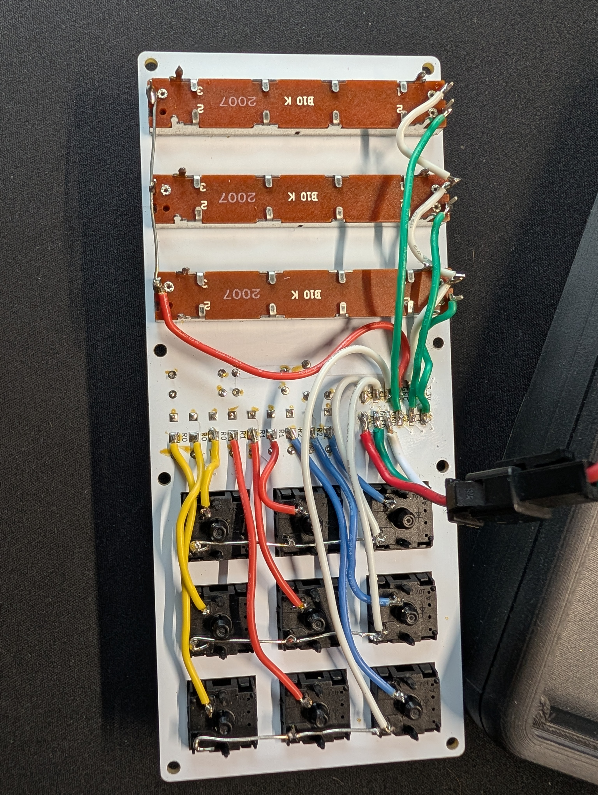

# Macro Pad 2.0

DIY custom macro keypad and [Deej](https://github.com/omriharel/deej) volume control board with RGB based on the Seeed Studio XIAO RP2040 and CircuitPython.

  <kbd>
    
  </kbd>

## Description

After really enjoying my [first DIY macro keypad](https://github.com/MichaelStickels/Macro_Keypad), I set out to create a second iteration of my own unique design that incorporated even more features. Mainly, I wanted to combine custom macro functionality with slide potentiometers for per-app volume control with Deej. This macro pad prioritizes looks rather than targeting the lowest cost or easiest assembly. The keyswitches are frame-mounted through the PCB so require hand wiring on the back, and the special side lit LED strip for the RGB is a bit spendy. But I am very happy with how it turned out, and it looks great on my desk.

### Features

- 9 fully programmable custom macro keys
- 3 volume sliders for use with Deej
- Fully customizable RGB and onboard button
- Easily change settings with almost any text editor
- USB C interface
- Mechanical keyswitches
- No driver needed
- Open source

### Built with

- CircuitPython
- Adafruit NeoPixel
- Adafruit MatrixKeypad
- Deej
- Love

## Photos

Some more photos of the project and the build process.

  <kbd>
    
  </kbd>
 <!--  caption of what is in this photo -->

  <kbd>
    
  </kbd>
 <!--  caption of what is in this photo -->

  <kbd>
    
  </kbd>
 <!--  caption of what is in this photo -->

## Building One Yourself

#### Here's what you'll need:
1. Custom PCB from an online supplier
2. 3D printed case
3. All parts listed on the BOM below
4. One USB-C cable
5. Basic soldering tools

### Custom PCB

PCB Gerber files are included in the release. Simply upload the whole .zip to the custom PCB manufacturer of your choice to order one for yourself (like JLPCB). This project only needs a very basic 2 layer PCB, I recommend white to show off the RGB. Make sure you choose the 'remove mark' or equivilent option to make sure they don't print an order number on the front fo your PCBs.

### 3D Printed Case

The case top uses translucent filament as a light pipe for the LEDs. At this revision, the design requires a multi-material printer. If you don't want to implement the RGB, you can print it all in one color on almost any printer. STL, 3MF, and F3D files are included for all parts.

  <kbd>
    
  </kbd>
 <!--  caption of what is in this photo -->

### Bill Of Materials  
[Here](https://www.digikey.com/short/9nwmrv4t) is a DigiKey cart with all electronic components ready to order.

| Quantity | Item                                           | DigiKey Link                                                                                                    |
|----------|------------------------------------------------|-----------------------------------------------------------------------------------------------------------------|
| 1        | MacroPad PCB                                   |                                                                                                                 |
| 1        | Seeed Studio XIAO RP2040                       | [1597-102010428-ND](https://www.digikey.com/en/products/detail/seeed-technology-co-ltd/102010428/14672129)      |
| 9        | Cherry MX Style Keyswitches                    | [CH196-ND](https://www.digikey.com/en/products/detail/cherry-americas-llc/MX1A-E1NN/40084)                      |
| 9        | Keycaps                                        | [1528-5662-ND](https://www.digikey.com/en/products/detail/adafruit-industries-llc/5662/18716469)                |
| 3        | 45mm 10k Slide Potentiometers                  | [PTA4553-2015CPB103-ND](https://www.digikey.com/en/products/detail/bourns-inc/PTA4553-2015CPB103/3781213)       |
| 1        | 6x6mm Tactile Push Button                      | [450-1650-ND](https://www.digikey.com/en/products/detail/te-connectivity-alcoswitch-switches/1825910-6/1632536) |
| 4        | 10kΩ Resistors                                 | [MFP-25BRD52-10K](https://www.digikey.com/en/products/detail/yageo/MFP-25BRD52-10K/2058797)                     |
| 9        | 1N4148 Diodes                                  | [1N4148FS-ND](https://www.digikey.com/en/products/detail/onsemi/1N4148/458603)                                  |
| 1        | Side Lit 5v RGB LED Strip                      | [1528-2499-ND](https://www.digikey.com/en/products/detail/adafruit-industries-llc/3634/8019479)                 |
| 1        | 3D Printed Case                                |                                                                                                                 |
| 8        | M2.5 Screws                                    |                                                                                                                 |
| 8        | M2.5 Heat-set Inserts                          |                                                                                                                 |
| 6        | M2 Screws (to mount pots)                      |                                                                                                                 |
|          | Some small wire for hand soldering keyswitches |                                                                                                                 |

### Assembly

Solder the RP2040, resistors, diodes, and button to the front of the board. 3D-printable bend guides are included to get clean consistent shapes on all the diodes and resistors.

Then install the keyswitches and pots, and flip it over to hand wire the back.
The PCB features labeled pads on the back to connect the keyswitches, potentiometers, and RGB strip. Hand wiring these is a little tricky but results in a very clean look on the front.

  <kbd>
    
  </kbd>
 <!--  caption of what is in this photo -->

### Software

Once soldered up, install the [CircuitPython bootloader](https://circuitpython.org/board/seeeduino_xiao_rp2040/) onto the RP2040 using [these instructions](https://wiki.seeedstudio.com/XIAO-RP2040-with-CircuitPython/).

Then copy the entire contents of the firmware folder to the CIRCUITPYTHON drive. This includes the example configuration and the necessary external libraries.

Press the reset button or unplug and replug the RP2040 and your Macro Pad will be up and running!

For the volume sliders to work you will need to install and configure [Deej](https://github.com/omriharel/deej) using [these instructions](https://github.com/omriharel/deej?tab=readme-ov-file#how-to-run). My Deej config.yaml is included as an example.

### Configure

The Macro Pad can be easily configured using any text editor, including Notepad.

To keep your file explorer tidy, the Macro Pad does not show up as a storage device by default. To access the drive, hold the 6x6mm pushbutton down while the board boots (either by pressing the reset button or while plugging in).

It will show up on your computer as a new storage drive named MACROPAD. To configure the Pad, edit conig.py in your favorite text editor. In config.py you can edit the macro for each of the 9 keyswitches as well as the RGB mode, color, and brightness. More detailed instructions are in the file.

### Usage

WIP

### Troubleshooting

WIP

## Back matter

### Acknowledgements

Inspiration from the following projects:
* [ocreeb-12](https://github.com/sb-ocr/ocreeb-12/tree/main)
* [DuckyPad](https://github.com/dekuNukem/duckyPad)

README adapted from [TINY README](https://gist.github.com/noperator/4eba8fae61a23dc6cb1fa8fbb9122d45)

Huge shout-out to the [Deej](https://github.com/omriharel/deej) project, it's an awesome piece of software.

### See also

- [Getting Started with Seeed Studio XIAO RP2040](https://wiki.seeedstudio.com/XIAO-RP2040/)
- My first [Macro Keypad](https://github.com/MichaelStickels/Macro_Keypad)

### To-do

- [x] Implement Deej serial sender in CircuitPython
- [x] Implement configuration file
- [x] Test and refine 3D printed enclosure
- [x] Implement configurable RGB
- [ ] Implement push button to do... something?
- [ ] Expand built-in RGB options
- [ ] Revise case to work on single material printers
- [ ] DIY dye sublimation keycaps
- [ ] Create and publish Deej library for CircuitPython

### License

This project is licensed under the [GPL-3.0 License](LICENSE.md).

### Support

Like what I do?  

