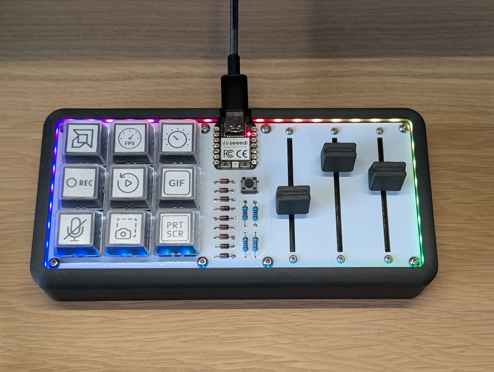
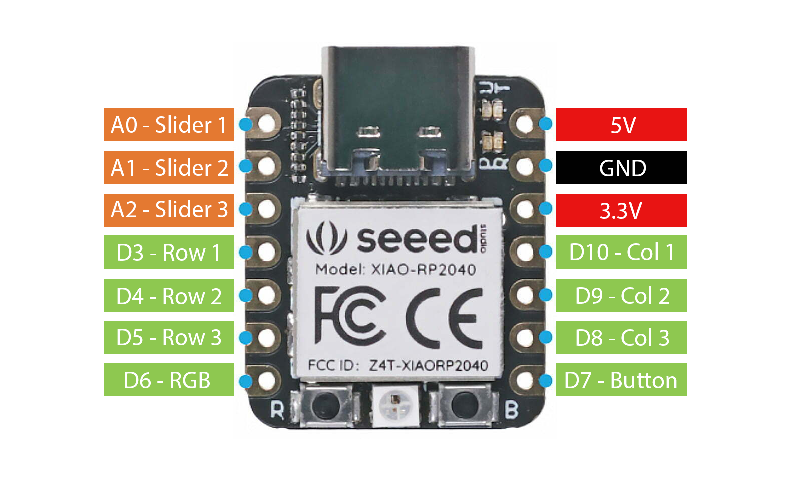

# Macro Pad 2.0

DIY custom macro keypad and [Deej](https://github.com/omriharel/deej) volume control board with RGB based on the Seeed Studio XIAO RP2040 and CircuitPython.

  <kbd>
    
  </kbd>

## Description

After really enjoying my [first DIY macro keypad](https://github.com/MichaelStickels/Macro_Keypad), I set out to create a second iteration of my own unique design that incorporated even more features. Mainly, I wanted to combine custom macro functionality with slide potentiometers for per-app volume control with Deej.

### Features

- 9 fully programmable custom macro keys
- 3 volume sliders for use with Deej
- Fully customizable RGB and onboard button
- Easily change settings with almost any text editor
- USB C interface
- Mechanical keyswitches
- No driver needed
- Open source

### Built with

- CircuitPython
- Adafruit NeoPixel
- Adafruit MatrixKeypad
- Deej
- Love

## Building One Yourself

#### Here's what you need:
1. Custom PCB from an online supplier
2. 3D printed case
3. All parts listed on the BOM below
4. One USB-C cable
5. Basic soldering tools

### PCB Files

Standard PCB Gerber files are [here](https://github.com/MichaelStickels/Macro_Pad_2.0/tree/main/PCB%20Order%20Files). Simply upload these files to the custom PCB manufacturer of your choice to order one for yourself. This project only needs a very basic 2 layer PCB, I recommend white to really show off the RGB!

### Bill Of Materials
(Where applicable, appropriate DigiKey part numbers are included)

1x MacroPad PCB
1x Seeed Studio XIAO RP2040 [1597-102010428-ND](https://www.digikey.com/en/products/detail/seeed-technology-co-ltd/102010428/14672129)
9x Cherry MX style keyswitches [CH196-ND](https://www.digikey.com/en/products/detail/cherry-americas-llc/MX1A-E1NN/40084)
9x Keycaps [1528-5662-ND](https://www.digikey.com/en/products/detail/adafruit-industries-llc/5662/18716469)
3x 45mm 10k slide potentiometers [PTA4553-2015CPB103-ND](https://www.digikey.com/en/products/detail/bourns-inc/PTA4553-2015CPB103/3781213)
1x 6x6mm tactile push button
4x 10kOhm resistors
9x 1N414B diodes
1x Side lit 5V RGB LED strip [1528-2499-ND](https://www.digikey.com/en/products/detail/adafruit-industries-llc/3634/8019479)
1x 3D Printed Case
8x M2.5 screws
8x M2.5 heat-set inserts or M2.5 nuts
6x M2 screws to mount pots
Some small wire for hand soldering keyswitches

### Software

This project relies on the following libraries:

### Configure

Link to configuration here

### Usage

GIFs are useful here to see the project in action.

### Troubleshooting

Or FAQs, if that's more appropriate.

## Photos

Some more photos of the project and the build process.

  <kbd>
    
  </kbd>
    
  caption of what is in this photo

  <kbd>
    
  </kbd>
    
  caption of what is in this photo

  <kbd>
    
  </kbd>
    
  caption of what is in this photo

## Back matter

### Acknowledgements

Inspiration from the following projects:
* [ocreeb-12](https://github.com/sb-ocr/ocreeb-12/tree/main)
* [DuckyPad](https://github.com/dekuNukem/duckyPad)
  

README adapted from [TINY README](https://gist.github.com/noperator/4eba8fae61a23dc6cb1fa8fbb9122d45)

Huge shout-out to the [Deej](https://github.com/omriharel/deej) project

### See also

- [Getting Started with Seeed Studio XIAO RP2040](https://wiki.seeedstudio.com/XIAO-RP2040/)
- My first [Macro Keypad](https://github.com/MichaelStickels/Macro_Keypad)

### To-do

- [x] Implement Deej serial sender in CircuitPython
- [ ] Implement configuration text file
- [x] Test and refine 3D printed enclosure
- [ ] Implement configurable RGB
- [ ] Implement push button
- [ ] Expand built-in RGB options
- [ ] DIY dye sublimation keycaps
- [ ] Create and publish Deej library for CircuitPython

### License

This project is licensed under the [GPL-3.0 License](LICENSE.md).

