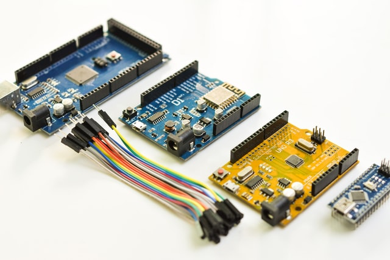
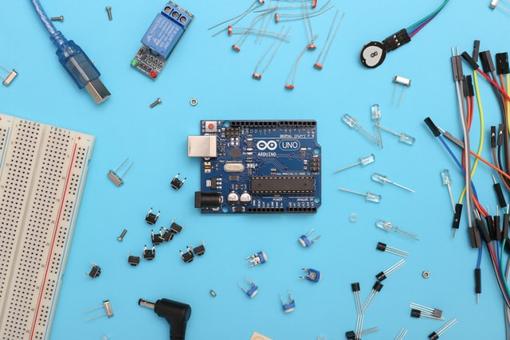

# Macro Pad 2.0

DIY custom macro keypad and [Deej](https://github.com/omriharel/deej) volume control board with RGB based on the Seeed Studio XIAO RP2040 and CircuitPython.

  <kbd>
    
  </kbd>

## Description

After really enjoying my [first DIY macro keypad](https://github.com/MichaelStickels/Macro_Keypad), I set out to create a second iteration of my own unique design that incorporated even more features. Mainly, I wanted to combine custom macro functionality with slide potentiometers for per-app volume control with Deej.

### Features

- 9 fully programmable custom macro keys
- 3 volume sliders for use with Deej
- Fully customizable RGB and onboard button
- Easily change settings with almost any text editor
- USB C interface
- Mechanical switches
- No driver needed
- Open source

### Built with

- CircuitPython
- Love

## Building One Yourself

### PCB Files

Standard PCB Gerber files are [here](https://github.com/MichaelStickels/Macro_Pad_2.0/tree/main/PCB%20Order%20Files). Simply upload these files to the custom PCB manufacturer of your choice to order one for yourself. This project only needs a very basic 2 layer PCB, I recommend white to really show off the RGB!

### Bill Of Materials

Add BOM here

### Software

Add link to necessary python files and description here

### Configure

Link to configuration here

### Usage

GIFs are useful here to see the project in action.

### Troubleshooting

Or FAQs, if that's more appropriate.

## Photos

Some more photos of the project and the build process.

  <kbd>
    
  </kbd>
    
  caption of what is in this photo

  <kbd>
    
  </kbd>
    
  caption of what is in this photo

  <kbd>
    
  </kbd>
    
  caption of what is in this photo

## Back matter

### Acknowledgements

Inspiration from the following projects:
* [ocreeb-12](https://github.com/sb-ocr/ocreeb-12/tree/main)
* [DuckyPad](https://github.com/dekuNukem/duckyPad)
  

README adapted from [TINY README](https://gist.github.com/noperator/4eba8fae61a23dc6cb1fa8fbb9122d45)

### See also

- [Deej](https://github.com/omriharel/deej)
- [Getting Started with Seeed Studio XIAO RP2040](https://wiki.seeedstudio.com/XIAO-RP2040/)
- My first [Macro Keypad](https://github.com/MichaelStickels/Macro_Keypad)

### To-do

- [ ] Completed Python firmware
- [ ] Print and test enclosure
- [ ] Photos of finished macropad
- [ ] Create custom keycaps

### License

This project is licensed under the [GPL-3.0 License](LICENSE.md).

